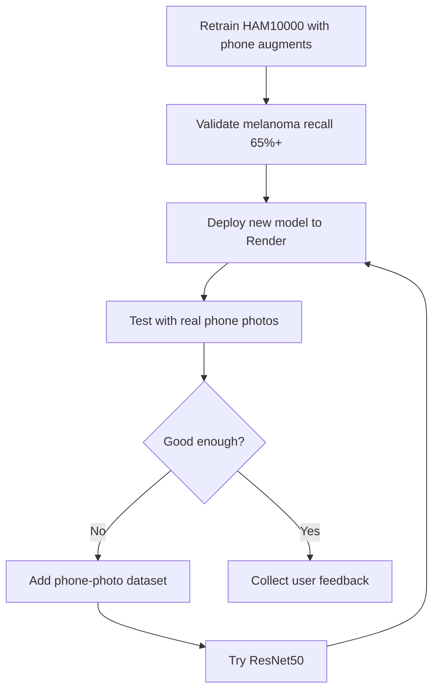

# Improving the Model for Phone Photos

HAM10000 images are **dermatoscopic** (clinical close-ups). Phone photos look different — more background, worse lighting, blur, different angles. To improve accuracy on casual photos, work through these steps in order.

## Priority 1: Retrain with phone-style augmentation (free, do this first)

The updated `training/train_ham10000.ipynb` adds augmentations that simulate phone photos:

- Gaussian blur (camera shake / out of focus)
- JPEG compression artifacts
- Wider zoom/crop (lesion smaller in frame)
- Stronger color and brightness variation
- Random perspective (angled shots)

**Action:** Re-run the full notebook on Kaggle GPU and replace `models/melanoma_model.pth`.

After training, verify with:

```bash
backend/.venv/bin/python scripts/validate_model.py
```

Melanoma recall on validation should be **65%+**. If it's near 0%, training did not work — re-run Stage 2.

---

## Priority 2: Add Skin_Lesion_Dataset (built into notebook)

The training notebook automatically merges **billalmanzoor/Skin_Lesion_Dataset**, which combines:

| Sub-dataset | Images | Type |
|-------------|--------|------|
| **ISIC 2019** | ~25,000 | Dermoscopy |
| **MED-NODE** | ~170 | Non-dermoscopic clinical |
| **PAD-UFES-20** | ~2,298 | Smartphone clinical |

### Setup on Kaggle

1. **Add Input** → `billalmanzoor/Skin_Lesion_Dataset`
2. **Add Input** → `kmader/skin-cancer-mnist-ham10000`
3. In Cell 5, confirm `USE_SKIN_LESION_DATASET = True`
4. Run all cells

### How labels are mapped

| Original label | Your label |
|----------------|------------|
| MEL / melanoma | melanoma (1) |
| Everything else (NV, BCC, naevus, etc.) | benign (0) |

Extra images are oversampled 3× during training.

### Other datasets (optional)

| Dataset | What it adds |
|---------|--------------|
| More ISIC years | Additional variety |

---

## Priority 3: Use a larger model

ResNet18 is fast but limited. On Kaggle, try:

| Model | Trade-off |
|-------|-----------|
| **ResNet50** | Better accuracy, ~2× slower |
| **EfficientNet-B0** | Strong accuracy per parameter |
| **MobileNetV3** | Faster, good for deployment |

In the notebook, change:

```python
model = models.resnet50(weights=models.ResNet50_Weights.IMAGENET1K_V1)
```

Update `build_model()` in `backend/model_loader.py` to match.

---

## Priority 4: Tune the screening threshold

The app flags melanoma when probability ≥ threshold (default **35%**).

| Threshold | Effect |
|-----------|--------|
| **Lower (0.25)** | Catches more melanoma, more false alarms |
| **Higher (0.50)** | Fewer false alarms, may miss cases |

After Kaggle training, the notebook prints a recommended threshold. It's saved in `melanoma_model.pth` automatically.

---

## Priority 5: Preprocess phone photos before inference

Optional backend improvements:

1. **Auto-crop** — detect the darkest/most colorful region (rough lesion centering)
2. **Reject bad uploads** — too small, too blurry, no skin detected
3. **Show confidence breakdown** — already in the UI; helps users interpret borderline results

---

## What won't fix it alone

| Approach | Why it's not enough |
|----------|---------------------|
| Only lowering the threshold | More false positives, doesn't teach new patterns |
| Only using the demo model | Random head — not trained on skin |
| Only better UI | Can't fix a model that never learned phone photos |
| Training on HAM10000 only | Dataset is almost all dermoscopy |

---

## Recommended roadmap



---

## Testing checklist for phone photos

Before sharing publicly, test with:

- [ ] Close-up mole photo, good light
- [ ] Same mole from 2 feet away (lesion small in frame)
- [ ] Slightly blurry photo
- [ ] Indoor yellow lighting
- [ ] Outdoor bright sunlight
- [ ] Known benign nevus image from web
- [ ] Known melanoma dermoscopy image from web (ISIC)

Record melanoma probability for each. If all show &lt;10%, the model still needs retraining.

---

## Disclaimer

Even a strong model is **not a medical device**. Always tell users to see a dermatologist for concerning lesions.
